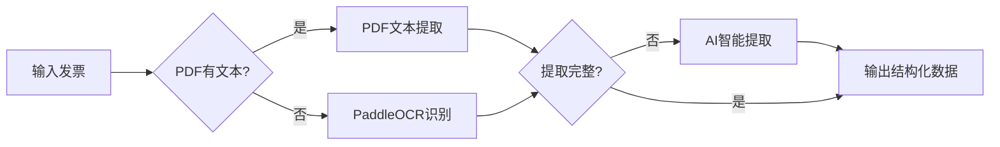

# 🧾 智能发票重命名工具

> 基于 **PDF解析 + OCR识别 + AI模型** 的三层智能发票处理方案

[](https://www.python.org/)
[](https://github.com/PaddlePaddle/PaddleOCR)
[](https://www.deepseek.com/)
[](LICENSE)

## ✨ 特性

- 🎯 **三层智能处理**：PDF文本 → OCR识别 → AI理解
- 📄 **支持多种格式**：PDF、JPG、PNG、JPEG、BMP
- 🌏 **完美支持中文**：基于PaddleOCR，中文识别率最高
- 🤖 **AI智能提取**：集成DeepSeek大模型，语义理解
- 💰 **超高性价比**：¥1可处理约2000张发票
- 🔒 **安全备份**：自动备份到 `rename_[随机后缀]` 目录

## 🚀 快速开始

### 1. 安装依赖

```bash
pip install -r requirements.txt
```

### 2. 配置API Key

复制 `.env.example` 到 `.env`：

```bash
cp .env.example .env
```

编辑 `.env` 文件，填入你的API Key（推荐使用 DeepSeek）：

```bash
MODEL_NAME=deepseek-chat
OPENAI_API_KEY=sk-your-deepseek-api-key-here
OPENAI_API_BASE=https://api.deepseek.com
```

**获取 API Key：**
- [DeepSeek](https://platform.deepseek.com/) - 价格最低，推荐使用
- [Moonshot（月之暗面）](https://platform.moonshot.cn/)
- [OpenAI](https://platform.openai.com/)

### 3. 运行程序

```bash
python3 main.py
```

## 📸 使用截图

### 支持的发票类型

| 类型 | 说明 | 处理方式 |
|------|------|----------|
| ✅ PDF发票（有文本） | 标准PDF发票 | pdfplumber 文本提取 |
| ✅ PDF扫描件 | 扫描的PDF | PaddleOCR 识别 |
| ✅ 图片发票 | JPG/PNG照片 | PaddleOCR 识别 |
| ✅ 手工拍照 | 手机拍摄 | PaddleOCR + AI |
| ✅ 外文发票 | 英文/日文等 | AI 智能理解 |

## 📋 可提取字段

- 发票号码
- 开票日期
- 购方名称 / 购方税号
- 销方名称 / 销方税号
- 合计金额
- 总税额
- 价税合计（小写/大写）
- 开票人

## 🔄 处理流程



**三层智能处理：**

1. **第一层**：PDF文本提取（最快，0.1秒/张）
2. **第二层**：PaddleOCR识别（中等，2-5秒/张）
3. **第三层**：AI语义理解（较慢，5-10秒/张，但最智能）

## 💰 成本对比

| AI模型 | 输入价格 | 输出价格 | 中文效果 | 推荐度 |
|--------|---------|---------|----------|--------|
| **DeepSeek** | ¥1/百万tokens | ¥2/百万tokens | ⭐⭐⭐⭐⭐ | 🔥 推荐 |
| Moonshot | ¥12/百万tokens | ¥12/百万tokens | ⭐⭐⭐⭐⭐ | ⭐⭐⭐⭐ |
| OpenAI GPT-4o | $2.5/百万tokens | $10/百万tokens | ⭐⭐⭐⭐ | ⭐⭐⭐ |

**成本估算：**
- 1张发票 ≈ 500 tokens
- DeepSeek: **¥1 可处理约 2000张发票**

## 🛠️ 技术栈

| 组件 | 技术 | 用途 |
|------|------|------|
| PDF解析 | [pdfplumber](https://github.com/jsvine/pdfplumber) | PDF文本提取 |
| OCR识别 | [PaddleOCR](https://github.com/PaddlePaddle/PaddleOCR) | 图片/扫描件文字识别 |
| AI模型 | [LangChain](https://github.com/langchain-ai/langchain) + DeepSeek | 智能字段提取 |
| GUI | [Tkinter](https://docs.python.org/3/library/tkinter.html) | 用户界面 |

## 📁 项目结构

```
G-P-1-ChatAi/
├── main.py                   # 主程序入口
├── chat_ai_rename.py         # AI模型和OCR封装
├── rename_function.py        # 重命名核心逻辑
├── invoice_rename_config.py  # GUI配置界面
├── requirements.txt          # Python依赖
├── .env.example              # 配置文件模板
├── test_paddleocr.py         # PaddleOCR测试脚本
├── SETUP_GUIDE.md            # 详细安装指南
└── README.md                 # 本文件
```

## 🧪 测试

测试 PaddleOCR 是否正常工作：

```bash
python3 test_paddleocr.py
```

预期输出：

```
============================================================
✅ PaddleOCR安装测试通过！
============================================================
```

## ⚠️ 注意事项

1. **首次运行**：PaddleOCR会自动下载模型（约200MB），只需下载一次
2. **处理速度**：
   - PDF文本：⚡⚡⚡ 最快（0.1秒/张）
   - OCR识别：⚡⚡ 中等（2-5秒/张）
   - AI处理：⚡ 较慢（5-10秒/张）
3. **文件名冲突**：自动添加时间戳避免覆盖
4. **API限制**：遇到429错误会自动重试（最多3次）

## 🆚 与其他方案对比

| 特性 | 本项目 | G-P-3-Local | Receipt-OCR-Analyzer-AI |
|------|--------|-------------|--------------------------|
| PDF文本提取 | ✅ | ✅ | ❌ |
| OCR识别 | ✅ PaddleOCR | ❌ | ✅ doctr |
| AI智能提取 | ✅ DeepSeek | ❌ | ❌ |
| 中文支持 | ⭐⭐⭐⭐⭐ | ⭐⭐⭐⭐⭐ | ⭐⭐ |
| 外文支持 | ⭐⭐⭐⭐ | ❌ | ⭐⭐⭐ |
| 图片支持 | ✅ | ❌ | ✅ |
| 提取字段 | 11个 | 17个 | 6个 |

**结论：本项目功能最全面，性价比最高！** 🏆

## 📝 更新日志

### v1.0.0 (2025-01-07)
- ✅ 集成 PaddleOCR 3.3.2
- ✅ 集成 DeepSeek AI
- ✅ 支持PDF/图片/扫描件
- ✅ 三层智能处理流程
- ✅ 自动备份机制
- ✅ GUI配置界面

## 📄 许可证

MIT License

## 👤 作者

**Esther** - [GitHub](https://github.com/esther)

## 🤝 贡献

欢迎提交 Issue 和 Pull Request！

## ⭐ Star History

如果这个项目对你有帮助，请给个 Star ⭐

## 📮 联系方式

邮箱：esther@feedmob.com

---

**Made with ❤️ by Esther**
